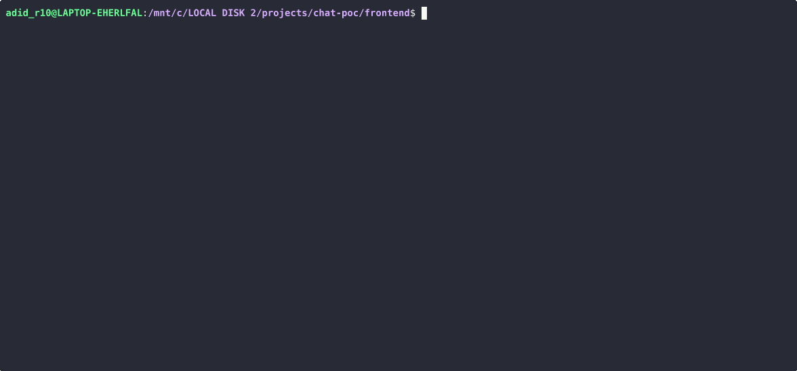

## Chat POC – OpenCode Architecture Demo

A streaming chat application demonstrating OpenCode's real-time TUI architecture using modern tools:
- **Backend**: Bun + TypeScript with streaming HTTP responses and bash tool execution
- **Frontend**: Go TUI powered by Bubble Tea and Lipgloss
- **Communication**: Character-by-character streaming similar to AI chat interfaces
- **Tool Calls**: Execute system commands directly from chat (like OpenCode's tool system)

## Chat POC Demo


---

## 🏗️ Architecture Overview

This project replicates OpenCode's **Bus-powered backend** pattern with a TUI frontend that consumes **structured JSON events**.

```text
User (TUI) 
   │
   ▼
[Go TUI] --(HTTP POST /chat)--> [Bun Backend]
   │                               │
   │                               ▼
   │                       [ Event Bus 🚌 ]
   │                               │
   │                  ┌────────────┴───────────┐
   │                  │                        │
   │         [Tool Executor]            [AI/Text Generator]
   │                  │                        │
   │                  ▼                        ▼
   │           Bus.publish()            Bus.publish()
   │                  │                        │
   │                  └────────────┬───────────┘
   │                               │
   │        Bus subscribers (HTTP stream writer, loggers, analytics)
   │                               │
   │<---------------- JSON Events (line by line) ----------------> 
   │
[Go TUI] ← reads JSON events, decodes into `Event` struct   
   │
   ▼
Bubble Tea Update() → updates model state → View() re-renders chat
```
## ✨ Key Features

- **🔄 Real-time Streaming**: Watch responses appear character-by-character like ChatGPT
- **🎨 Beautiful Terminal UI**: Professional styling with borders, colors, and layouts
- **📝 Chat History**: Persistent conversation with distinct user/bot message styling
- **🔧 Tool Execution**: Run system commands from chat (`ls`, `pwd`, `df`, `uname`)
- **⚡ Event-Driven**: Bubble Tea's reactive architecture for smooth interactions
- **🛡️ Error Handling**: Graceful connection failures and stream interruptions
- **🔒 Safe Execution**: Whitelisted commands only for security
- **📱 Responsive Design**: Adapts to terminal window resizing

## 📁 Project Structure

```text
chat-poc/
├── backend/                  # Bun TypeScript server
│   ├── package.json          # Dependencies: bun
│   └── server.ts             # HTTP server with streaming /chat endpoint + tool execution
│
├── frontend/                 # Go TUI application
│   ├── go.mod                # Dependencies: bubbletea, lipgloss
│   ├── go.sum                # Dependency checksums
│   ├── main.go               # Application entry point
│   └── chat.go               # Core TUI implementation with tool display
│
├── resources/                # Additional assets
│   ├── demo.cast
│   ├── demo.gif  
└── README.md                 # This documentation
```

## ✨ Key Highlights

### ⭐ Bus in Bun Backend
- Implemented central EventBus (`bus.ts`) with publish/subscribe
- Tool executor and AI-like response generator publish events
- The HTTP stream writer is just one subscriber
- Other subscribers can be added (logging, persistence, analytics) with zero changes to core logic
- Ensures loose coupling and extensibility

**Example backend event:**
```json
{"type":"tool.output","data":"-rw-r--r--  file1.txt","timestamp":1700000003}
```

### 🔄 Before vs After

#### Before (No Bus)
- `/chat` handler wrote directly to `controller.enqueue()`
- Markers like `[TOOL_START:...]`, `[TOOL_OUTPUT:...]`
- Only HTTP stream could consume events
- Tight coupling

#### After (With Bus 🚌)
- `/chat` handler publishes events to Bus
- HTTP stream subscribes and forwards events line-by-line JSON
- TUI decodes JSON events into Event
- Other subscribers (logs, DB, monitoring) can be plugged in easily
- Decoupled, extensible, structured

### 📟 TUI Adjustments (Go)

**Old:** Expected raw characters and custom `[TOOL_*]` markers.

**New:** Reads JSON events line-by-line. Example:
```json
{"type":"chat.char","data":"H"}
{"type":"tool.start","data":{"command":"ls"}}
{"type":"tool.output","data":"-rw-r--r-- file1.txt"}
{"type":"chat.complete"}
```

- Added Event struct in Go (`Type`, `Data`, `Timestamp`)
- Updated `sendMessage` → decode JSON into Event → publish into `appBus`
- Updated `Update()` → switch on `evt.Type` (`chat.char`, `chat.complete`, `tool.start`, `tool.output`, ...)
- Removed ad‑hoc bracket parsing logic

### ✅ Summary (Before vs After)

```
BEFORE:
TUI <--> Backend
- Direct enqueue with markers like [TOOL_START]
- One consumer (the client)
- Tight coupling

AFTER:
TUI <--> Backend (Bus-powered JSON events)
- Backend publishes structured events to Bus
- HTTP stream subscribes and forwards JSON lines
- TUI decodes JSON events, updates state
- Flexible, decoupled, extensible
```


## 🛠️ Prerequisites

Install these tools before running the project:

| Tool | Version | Install |
|------|---------|---------|
| **Bun** | Latest | [`bun.sh`](https://bun.sh) – Fast JavaScript runtime |
| **Go** | 1.21+ | [`golang.org`](https://golang.org) – Systems programming language |

## 🚀 Quick Start

### 1. Clone the repo

```bash
git clone <your-repo>
cd chat-poc
```

### 2. Backend setup

```bash
cd backend
bun install          # Install dependencies
bun run dev          # Start development server
```

Expected output (abridged):

```text
🚀 Chat server running on http://localhost:3000
📡 Endpoints:
  GET  /health
  POST /chat
```

### 3. Frontend setup (new terminal)

```bash
cd frontend
go mod tidy          # Download Go dependencies
go run .             # Launch TUI application
```

## 🎮 How to Use

- **Basic chat**
  - Type your message in the purple input box at the bottom
  - Press Enter to send (input clears automatically)
  - Responses stream in character-by-character
  - Scroll through history with color-coded borders
  - Press Ctrl+C to quit gracefully

- **Tool commands** (try these):

| Command | Triggers | What it does |
|---|---|---|
| List Files | "list files", "show files", "ls" | Shows directory contents with `ls -la` |
| Current Directory | "current directory", "pwd" | Shows working directory with `pwd` |
| Disk Usage | "disk usage", "df" | Shows disk space with `df -h` |
| System Info | "system info", "uname" | Shows system details with `uname -a` |

### Example chat session

You: What files are in this directory?

Bot: I'll execute the `ls` command for you...

```text
🔧 Executing: ls
total 16
drwxr-xr-x 4 user staff 128 Nov 15 10:30 .
drwxr-xr-x 5 user staff 160 Nov 15 10:25 ..
-rw-r--r-- 1 user staff 245 Nov 15 10:30 README.md
drwxr-xr-x 3 user staff 96 Nov 15 10:28 backend
drwxr-xr-x 3 user staff 96 Nov 15 10:28 frontend
```

Based on the output, I can see 5 items in the current directory.

### UI layout with tool calls

```text
💬 Chat POC – OpenCode Architecture Demo

╭─────────────────────────────────────────╮
│ You: Hello there!                       │  ← Green border (your messages)
╰─────────────────────────────────────────╯

╭─────────────────────────────────────────╮
│ Bot: Hi! How can I help you today?      │  ← Red border (bot messages)
╰─────────────────────────────────────────╯

╭═════════════════════════════════════════╮
│ Bot: I'm currently typing...▎           │  ← Yellow double border (streaming)
╰═════════════════════════════════════════╯

╭─────────────────────────────────────────╮
│ Type your message here...               │  ← Purple border (input)
╰─────────────────────────────────────────╯

╭─────────────────────────────────────────╮
│ You: Show me the files here             │
╰─────────────────────────────────────────╯

╭─────────────────────────────────────────╮
│ Bot: I'll execute the ls command for    │
│ you...                                  │
│                                         │
│ 🔧 Executing: ls                        │
│ total 16                                │
│ drwxr-xr-x  4 user  staff  128 ...      │
│ -rw-r--r--  1 user  staff  245 ...      │
│                                         │
│ Based on the output, I can see 5 items  │
│ in the current directory.               │
╰─────────────────────────────────────────╯

Press Enter to send • Ctrl+C to quit • Characters stream in real-time
```

## ⚙️ Technical Deep Dive

### Backend (Bun)

#### Tool detection and execution
- Tool detection → `detectToolCall()`
- Execution via Bun’s `$` operator (with whitelist)
- Publishes Bus events:

```ts
Bus.publish({ type: "tool.start", data: { command: "ls" } })
Bus.publish({ type: "tool.output", data: "-rw-r--r--  file1.txt" })
Bus.publish({ type: "chat.char", data: "H" })
Bus.publish({ type: "chat.complete" })
```

- HTTP stream subscribes and forwards these JSON events

### Frontend (Go TUI)

#### sendMessage
- Sends user input to backend
- Reads JSON lines from response
- Unmarshals into `Event`
- Publishes into `appBus`

#### Update handles events
- `"chat.char"` → appends characters live
- `"tool.start"` → render tool execution header
- `"tool.output"` → display results in code block
- `"chat.complete"` → finalize Bot message

## 🔧 Troubleshooting

### Backend issues

- **Error: Port 3000 in use**

```bash
lsof -ti:3000 | xargs kill -9    # Kill process on port 3000
bun run dev                      # Restart server
```

- **Error: Bun command not found**

```bash
curl -fsSL https://bun.sh/install | bash    # Install Bun
source ~/.bashrc                            # Reload shell
```

- **Error: Tool execution failed**

```bash
# Check if commands are available
ls --version
pwd --version
df --version
uname --version
```

### Frontend issues

- **Error: Go modules not found**

```bash
cd frontend
go mod tidy                # Re-download dependencies
go clean -modcache         # Clear module cache if needed
```

- **Error: Failed to connect to server**

```bash
# Check if backend is running
curl http://localhost:3000/health
# Should return: Server is running!
```

- **Error: Tool calls not working**

```bash
# Test tool detection manually
curl -X POST http://localhost:3000/chat \
  -H "Content-Type: application/json" \
  -d '{"message": "list files"}'
```

### Common issues

| Problem | Solution |
|---|---|
| No tool execution | Try exact phrases: "list files", "current directory" |
| Tool output garbled | Ensure terminal supports UTF-8 encoding |
| Commands not found | Check if `ls`, `pwd`, `df`, `uname` are in PATH |
| Permission denied | Some commands may require different permissions |
| Streaming stops during tools | Backend might have crashed – check console |

## 🎯 Learning Outcomes

After exploring this codebase, you'll understand:

- **Streaming HTTP Responses**: How to send data progressively without WebSockets
- **Event-Driven TUI**: Bubble Tea's Update/View architecture pattern
- **Terminal Styling**: Professional CLI interfaces with Lipgloss
- **Tool Execution**: Safe command execution with whitelisting
- **Protocol Design**: Custom markers for tool communication
- **Concurrent Programming**: Goroutines for non-blocking HTTP streaming

## 🔍 OpenCode Connections

- **TUI Architecture**: Similar to OpenCode's `packages/tui/` structure
- **Streaming Responses**: How AI providers stream tokens to the interface
- **Tool System**: How OpenCode executes tools and displays results
- **State Management**: Event-driven updates for chat conversations
- **Security**: Command whitelisting and safe execution patterns